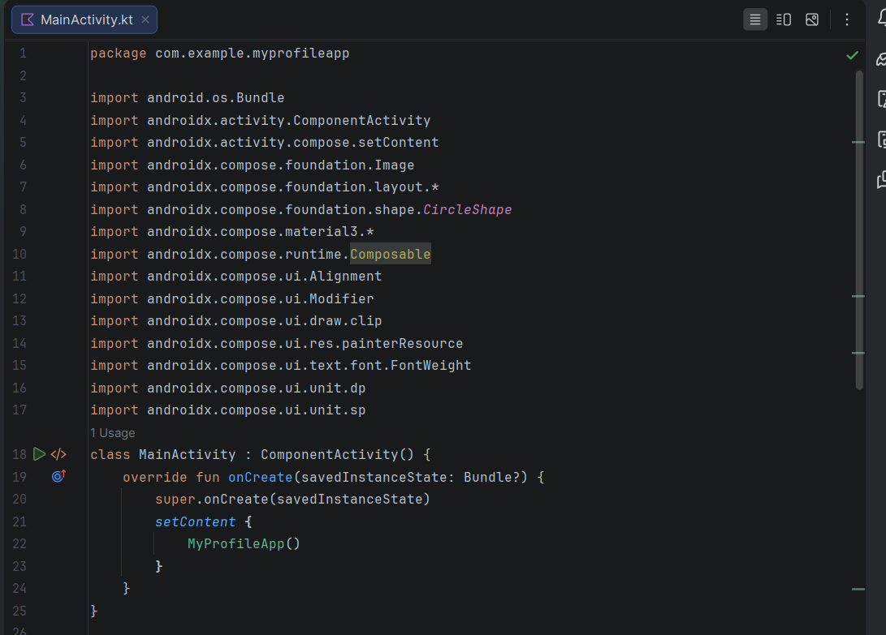
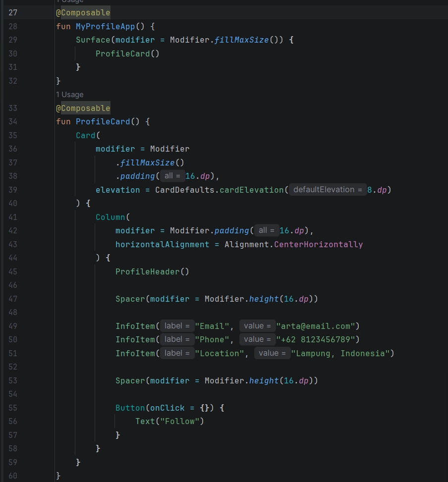
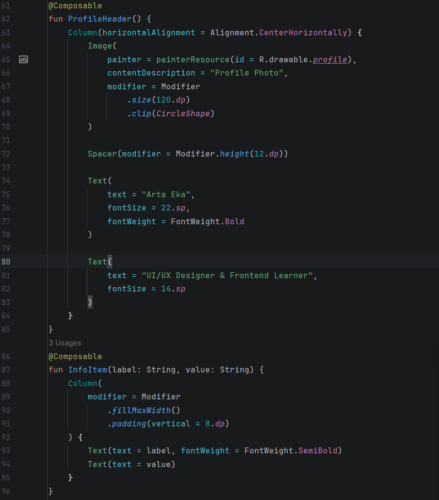

MyProfileApp

My Profile App adalah aplikasi Android sederhana yang dibuat menggunakan Jetpack Compose untuk menampilkan halaman profil pengguna.

## Fitur Utama
* Foto profil berbentuk lingkaran
* Nama dan bio singkat
* Informasi kontak (Email, Phone, Location)
* Tombol interaksi

## Komponen yang Digunakan
Aplikasi ini dibuat dengan beberapa Composable reusable seperti:
* ProfileHeader
* ProfileCard
* InfoItem

Komponen layout yang digunakan meliputi Column, Card, Text, Image, Button, dan Spacer.

## Tujuan
Aplikasi ini dibuat untuk memenuhi tugas praktikum mata kuliah Pengembangan Aplikasi Mobile serta melatih penggunaan dasar Jetpack Compose dalam membangun antarmuka pengguna.

## Kode yang digunakan:

